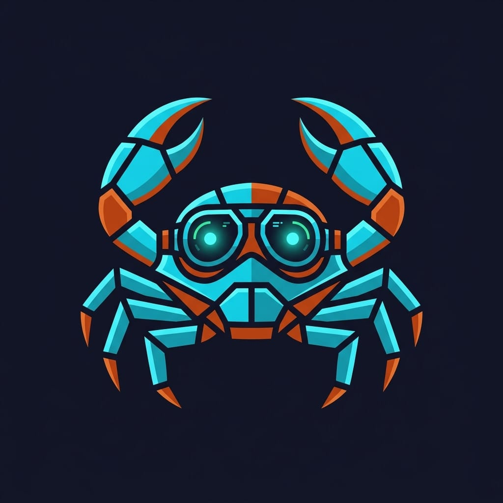

<p align="center">
  
</p>

<p align="center">
  <a href="https://github.com/mpiton/tauri-pilot/actions/workflows/ci.yml"></a>
  <a href="https://github.com/mpiton/tauri-pilot/blob/main/LICENSE"></a>
  
  
  
</p>

# tauri-pilot

**Interactive testing CLI for Tauri v2 apps** — lets AI agents (Claude Code) and developers inspect, interact with, and debug Tauri applications in real-time.

<p align="center">
  
</p>

```
$ tauri-pilot snapshot -i
- heading "PR Dashboard" [ref=e1]
- textbox "Search PRs" [ref=e2] value=""
- button "Refresh" [ref=e3]
- list "PR List" [ref=e4]
  - listitem "fix: resolve memory leak #142" [ref=e5]
  - listitem "feat: add workspace support #138" [ref=e6]
- button "Load More" [ref=e7]

$ tauri-pilot click @e3
ok

$ tauri-pilot fill @e2 "workspace"
ok
```

## Why?

There's no tool for AI agents to interact with Tauri app UIs. Playwright doesn't work (Tauri uses WebKitGTK, not Chromium). tauri-pilot bridges this gap with a lightweight plugin + CLI that speaks a protocol optimized for LLM consumption.

## How it works

```
┌──────────────┐   Unix Socket    ┌─────────────────────────────┐
│  tauri-pilot  │ ◄──────────────► │  tauri-plugin-pilot (Rust)  │
│  (CLI)        │   JSON-RPC       │  embedded in your app       │
└──────────────┘                   │                             │
                                   │  ┌─────────────────────┐   │
                                   │  │  JS Bridge (injected)│   │
                                   │  │  window.__PILOT__    │   │
                                   │  └─────────────────────┘   │
                                   │  WebView (WebKitGTK)        │
                                   └─────────────────────────────┘
```

1. **Plugin** embeds in your Tauri app (debug builds only), starts a Unix socket server
2. **CLI** connects to the socket, sends JSON-RPC commands
3. **JS Bridge** injected into the WebView handles DOM inspection and interaction

## Quick Start

### 1. Add the plugin to your Tauri app

```toml
# src-tauri/Cargo.toml
[dependencies]
tauri-plugin-pilot = { git = "https://github.com/mpiton/tauri-pilot" }
```

```rust
// src-tauri/src/main.rs
fn main() {
    let mut builder = tauri::Builder::default();

    #[cfg(debug_assertions)]
    {
        builder = builder.plugin(tauri_plugin_pilot::init());
    }

    builder.run(tauri::generate_context!()).expect("error running app");
}
```

### 2. Install the CLI

```bash
cargo install tauri-pilot
```

### 3. Use it

```bash
# Check connection
tauri-pilot ping

# Inspect the UI
tauri-pilot snapshot -i          # interactive elements only
tauri-pilot snapshot -s "#sidebar"  # scoped to a CSS selector

# Interact
tauri-pilot click @e3
tauri-pilot fill @e2 "hello"
tauri-pilot press Enter

# Verify
tauri-pilot assert text @e1 "Expected text"
tauri-pilot assert visible @e3
tauri-pilot wait --selector ".success-message"
```

## Commands

| Command | Description |
|---------|-------------|
| `ping` | Health check |
| `snapshot` | Accessibility tree with refs (`--save` to persist) |
| `diff` | Compare snapshots, show only changes |
| `click` | Click an element |
| `fill` | Clear + type in an input |
| `type` | Type without clearing |
| `press` | Send a keystroke |
| `select` | Select a dropdown option |
| `check` | Toggle a checkbox |
| `scroll` | Scroll page or element |
| `text` | Get element text content |
| `html` | Get element innerHTML |
| `value` | Get input value |
| `attrs` | Get all attributes |
| `eval` | Execute arbitrary JS |
| `ipc` | Call a Tauri IPC command |
| `screenshot` | Capture as PNG |
| `wait` | Wait for element to appear/disappear |
| `navigate` | Change the WebView URL |
| `state` | Get URL, title, viewport, scroll |
| `assert` | One-step verification (text, visible, value, count...) |
| `logs` | Capture and display console output |
| `network` | Capture and display network requests |

## For AI Agents

tauri-pilot is designed for AI agent consumption. The workflow is:

1. `tauri-pilot snapshot -i` — get the accessibility tree with refs
2. Read the refs in the output (`@e1`, `@e2`, ...)
3. `tauri-pilot click @e3` — interact using refs
4. `tauri-pilot assert text @e1 "Dashboard"` — verify state in one step (exit 0 = pass, exit 1 = fail)
5. `tauri-pilot diff -i` — see only what changed (saves tokens vs full re-snapshot)
6. `tauri-pilot logs --level error` — check for JS errors

The `assert` command replaces the manual `text @ref` + parse + compare pattern, reducing round-trips and token usage.

Use `--json` for structured output when parsing programmatically.

## Requirements

- **Linux** (WebKitGTK) — macOS/Windows planned
- **Tauri v2** (v1 not supported)
- **Rust 1.94.1+** (LTS, edition 2024)

## License

MIT — see [LICENSE](LICENSE)
